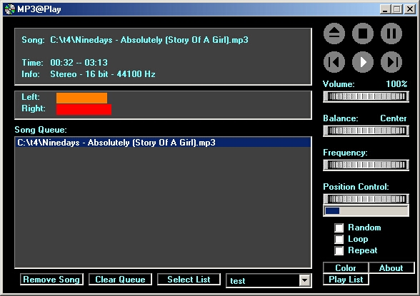



## MP3@Play

### Description

Its an mp3 player with a lot features. You can create your own play list, change the display colors, player includes balance, volume, frequency, and positional controls. Its has a output meter for both left and right channels. MP3@play also has repeat, loop, and randomize functions. I'm still working on the interface because I don't like the button layout but I thought it was worth posting the code. I used the digial music control(freeware) from http://www.izzyonline.com. Although the control has some very nice features I have come across some mp3s that dmc2 can't play. A possible work around for using this control is to re-record the mp3s using something like musicmatch jukebox(freeware). Hopefully the author will deal with these issue in a later release of DMC2.
 
### More Info
 

             |
---                |---
**Submitted On**   |2000-09-26 10:15:30
**By**             |[Karl J\. Sak](https://github.com/Planet-Source-Code/PSCIndex/blob/master/ByAuthor/karl-j-sak.md)
**Level**          |Intermediate
**User Rating**    |4.5 (18 globes from 4 users)
**Compatibility**  |VB 6\.0
**Category**       |[Sound/MP3](https://github.com/Planet-Source-Code/PSCIndex/blob/master/ByCategory/sound-mp3__1-45.md)
**World**          |[Visual Basic](https://github.com/Planet-Source-Code/PSCIndex/blob/master/ByWorld/visual-basic.md)
**Archive File**   |[CODE\_UPLOAD101729262000\.zip](https://github.com/Planet-Source-Code/karl-j-sak-mp3-play__1-11682/archive/master.zip)

